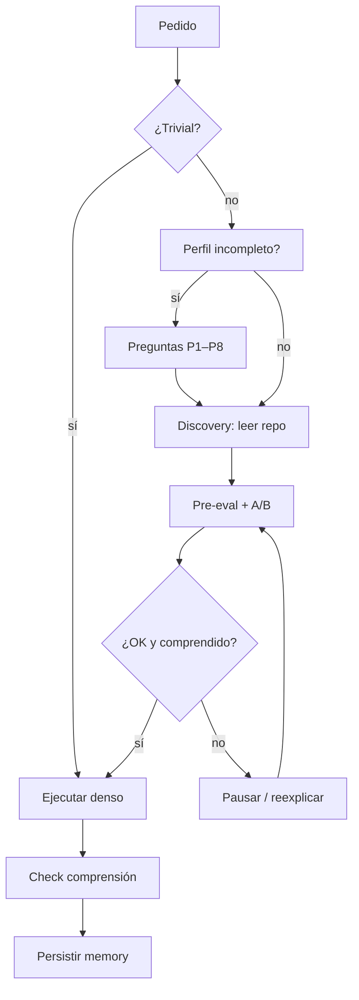

# AI Harness Template — multi-IA, genérico, token-first

**Versión:** `2.1.1` · ver [`VERSION`](VERSION) · historial [`CHANGELOG.md`](CHANGELOG.md) · cómo publicar [`VERSIONING.md`](VERSIONING.md)

Arnés portable para Cursor, Copilot, Claude, Gemini, Windsurf, Continue, Aider, Cline, JetBrains AI, Ollama y CLIs genéricos.

**Qué es:** un template. Lo copias a tu repo y le agregas tu código, ficheros y skills.  
**Proceso:** estudiar → descubrir (leer el proyecto) → proponer → confirmar → ejecutar → comprender → persistir.  
**Tono:** inteligente, conciliador, respetuoso. No asume ultra-expertos.  
**Pack opcional:** `.ai/skills/trading-ml.md` (mercados / ML).

---

## Implementación fácil (haz esto)

### Paso 1 — Copiar el arnés a tu proyecto

```bash
# Ajusta las rutas
HARNESS=/ruta/a/basic-personal-cursor-harness
TARGET=/ruta/a/tu-proyecto

mkdir -p "$TARGET/.github/prompts" "$TARGET/docs"

rsync -a "$HARNESS/.ai/" "$TARGET/.ai/"
rsync -a "$HARNESS/.cursor/" "$TARGET/.cursor/"
rsync -a "$HARNESS/.continue/" "$TARGET/.continue/"

cp "$HARNESS/AGENTS.md" "$HARNESS/CLAUDE.md" "$HARNESS/GEMINI.md" "$TARGET/"
cp "$HARNESS/.github/copilot-instructions.md" "$TARGET/.github/"
cp "$HARNESS/.github/prompts/"*.md "$TARGET/.github/prompts/" 2>/dev/null || true

# Opcional: dejar el tutorial dentro del proyecto
cp "$HARNESS/README.md" "$TARGET/docs/HARNESS.md"
cp "$HARNESS/NEXT_STEPS.md" "$TARGET/docs/HARNESS_NEXT_STEPS.md"
```

Detalle / copia mínima Ollama: [`docs/getting-started/INSTALL.md`](docs/getting-started/INSTALL.md).  
`docs/getting-started/` es **solo manual** — no la detecta el arnés; tu proyecto puede llamarse como quieras.

### Paso 2 — Abrir el proyecto en tu IA

| Si usas… | El arnés se activa vía… |
|---|---|
| **Cursor** | `.cursor/rules/` (automático) + `AGENTS.md` |
| **Copilot** | `.github/copilot-instructions.md` |
| **Claude** | `CLAUDE.md` |
| **Gemini** | `GEMINI.md` |
| **Continue** | `.continue/rules/` |
| **Ollama / CLI** | Pega al inicio: *“Sigue AGENTS.md y modo ultra”* |

### Paso 3 — Rellenar el mapa (2 minutos, sin secretos)

Edita `.ai/memory/workspace.md` en **tu** proyecto:
- módulos reales (api, web, worker…),
- stack,
- entornos (local / staging / prod).

No pegues keys, tokens ni datos personales.

### Paso 4 — Primera conversación (copia/pega)

**Mensaje 1**
```
Arnés activo. Objetivo de sesión: <una frase>.
Perfil incompleto: hazme P1–P8 en un solo bloque.
No edites código hasta que confirme una opción A/B.
```

**Mensaje 2** — responde en lista corta (ejemplo):
```
P1: backend mid
P2: estabilizar auth
P3: NestJS + Postgres
P4: solo staging esta semana
P5: keys, PII usuarios, pricing
P6: proponer-siempre
P7: Cursor + Ollama
P8: no
```

**Mensaje 3**
```
Propón (no implementes) el plan para <tarea>.
Formato session-gate + opciones A/B. Basa el plan en archivos que leas del repo.
```

**Mensaje 4**
```
Aprobado A. Implementa. Luego 1 pregunta de comprensión.
```

Guion completo: [`docs/getting-started/FIRST_SESSION.md`](docs/getting-started/FIRST_SESSION.md).

### Paso 5 — (Opcional) Activar trading / ML

Si tu proyecto es de mercados, el agente cargará `.ai/skills/trading-ml.md` cuando toque señales/modelos/broker.  
No hace falta ser quant: el skill incluye glosario y prioriza **paper** (simulación) antes de **live**.

### Paso 6 — Ir trabajando

En cada pedido no trivial el agente debe:
1. **Leer** archivos de tu repo (no inventar APIs ni stacks),
2. **Proponer** con impacto + opciones A/B,
3. **Esperar** tu OK,
4. **Ejecutar** y comprobar que entendiste el cambio,
5. **Guardar** decisiones/patrones en `.ai/memory/` si aplica.

Ritmo por defecto: **proponer-siempre**.

---

## Dónde está el “Modo Absoluto++” y el stack de protocolos

Está en **`.ai/protocols/`** (no en la raíz). Hay tres versiones según tokens:

| Archivo | Contenido | Cuándo usarlo |
|---|---|---|
| [`.ai/protocols/operating-mode.md`](.ai/protocols/operating-mode.md) | **Full:** Regla Cero + Absoluto++ + Arquitecto-Ejecutor + Núcleo + Gate + tono + discovery | Primera sesión de diseño / necesitas el texto completo |
| [`.ai/protocols/operating-mode.compact.md`](.ai/protocols/operating-mode.compact.md) | Misma filosofía, **resumida** (default en Cursor/Copilot/Claude) | Día a día |
| [`.ai/protocols/operating-mode.ultra.md`](.ai/protocols/operating-mode.ultra.md) | Mínimo absoluto para locales | Ollama / modelos pequeños / poco contexto |

### Qué significa cada capa (resumen)

| Capa | Idea |
|---|---|
| **Regla Cero** | Cada turno entrega algo concreto; sin loops mentales sin salida |
| **Session Gate** | En cambios no triviales: proponer A/B y esperar OK (ver `.ai/harness/session-gate.md`) |
| **Discovery** | Leer tu proyecto antes de proponer (ver `.ai/harness/discovery.md`) |
| **Absoluto++** | En la fase *ejecutar*: máximo densidad, poco relleno, claridad |
| **Arquitecto-Ejecutor** | Pensar SPOF → por qué → lógica → MVP viable |
| **Núcleo** | Corregir inconsistencias en silencio; advertir riesgos reales con calma |

El tono conciliador y “no asumir expertos” está **integrado** en esos protocols (v2.1), no es un archivo aparte.

Bridges (Cursor/Copilot/etc.) **apuntan** a compact/ultra; no duplican el texto largo.

---

## Propósito (problemas que resuelve)

| Problema | Respuesta del arnés |
|---|---|
| El chat arranca editando | Session Gate |
| Cada IA tiene su carpeta | Núcleo `.ai/` + bridges |
| Modelos locales se ahogan | Modo `ultra` |
| Fuga de secretos | `skills/confidentiality.md` |
| Se pierde contexto entre sesiones | Update-trigger → `memory/` |
| No entiendes el cambio | Check de comprensión + A/B |
| El agente inventa tu API | Discovery (lee el repo) |

---

## ¿Para qué sirve `.github/`?

**Sí aporta valor** con GitHub Copilot: carga `copilot-instructions.md` solo.  
Cursor usa `.cursor/rules/`, Claude `CLAUDE.md`, Gemini `GEMINI.md`.  
Mantener `.github/` hace el arnés transversal. Detalle: `.ai/adapters/copilot.md`.

---

## Mapa mental



---

## Ejemplo — BREAKING tras leer el proyecto

El agente **no** asume rutas. Primero busca en *tu* repo.

**Pedido:** “Renombra el endpoint de usuarios al de cuentas.”

**Agente:** lee rutas/OpenAPI → encuentra p.ej. `src/routes/users.ts` y `openapi.yaml`.

**Propone (sin editar aún):**
```
IMPACTO: BREAKING (evidencia: openapi.yaml + clients/sdk.ts)
ALCANCE: [paths reales leídos]
RIESGO: clientes actuales fallarán
PROPUESTA: alias temporal vs rename duro
OPCIONES: A) alias  B) rename duro  C) pausar
COMPRENSIÓN: ¿OK con que B rompa integraciones externas?
```

Hasta **A/B/OK** → no edita. SAFE (typo) puede ir directo.  
SENSITIVE (secretos, PII, prod, permisos) = mismo freno.

---

## Uso eficiente (tokens)

| Situación | Cargar |
|---|---|
| Default | constitution + gate + discovery + confidentiality + **compact** |
| Ollama / Ligero | lo mismo con **ultra** |
| Arquitectura | + `memory/decisions.md` + `patterns.md` |
| Mercados / trading | + `skills/trading-ml.md` |
| Nunca por defecto | `generated/` · `cache/` · `.env` · skills que no aplican |

---

## Confidencialidad

No pegues keys ni `.env` en el chat. Memory solo con placeholders.  
Si un secreto entró al historial → rota credenciales.

---

## Compatibilidad y siguientes pasos

- Bridges por herramienta: [`.ai/adapters/README.md`](.ai/adapters/README.md)  
- Ideas opcionales (Continue, Aider, secret scanning, etc.): [`NEXT_STEPS.md`](NEXT_STEPS.md)

---

## Estructura del repo template

```
VERSION CHANGELOG.md VERSIONING.md
AGENTS.md CLAUDE.md GEMINI.md README.md NEXT_STEPS.md
.ai/                  núcleo (fuente de verdad / runtime del arnés)
.cursor/ .github/ .continue/   bridges
docs/getting-started/          manual (NO runtime; nombre del proyecto consumidor irrelevante)
```

Efectividad estimada: ver [`.ai/audit/architecture-score.md`](.ai/audit/architecture-score.md).
